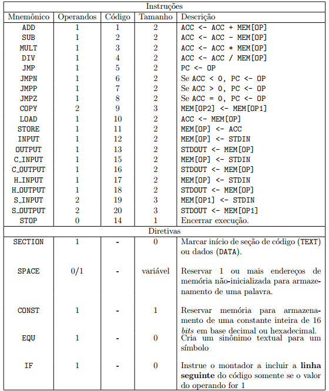

# [IA-32](https://github.com/LSantos06/IA-32)
### Trabalho 2 de Software Básico 1/2017
O trabalho consiste em duas partes:
1.  Implementar em C um método de tradução de uma linguagem de montagem simples para uma representação de código objeto e _IA-32_; 
2.  Implementar um programa em C um arquivo executável em formato _ELF32_ (Bônus).

### Integrantes do grupo
* Davi Rabbouni - 15/0033010
  - [X] _Versão do gcc_: gcc version 6.2.0 20161005 (Ubuntu 6.2.0-5ubuntu12) 
  - [X] _Sistema Operacional_: Ubuntu 16.10 (64-bit) "yakkety"
* Lucas Santos - 14/0151010
  - [X] _Versão do gcc_: gcc version 5.4.0 20160609 (Ubuntu 5.4.0-6ubuntu1~16.04.4) 
  - [X] _Sistema Operacional_: elementary OS 0.4 Loki (64-bit) Built on "Ubuntu 16.04.2 LTS"

### Parte 1
O programa ligador (__tradutor.c__) deve receber um arquivo (__arquivo.asm__) como argumento. Este arquivo deve estar na linguagem _Assembly Hipotética_ vista em sala de aula, separado em seções de _dados_ e _códigos_. 
__Não__ será feita detecção de erros léxicos, semânticos ou sintáticos. 
A linguagem _Assembly Hipotética_ é formada por um conjunto de instruções e diretivas mostradas na tabela a seguir:

  
   
  <t><b>Figura 1</b>: Tabela de instruções e diretivas da linguagem <i>Assembly Hipotética</i>.</t>
   

O programa deve entregar como saída um arquivo em formato texto (__arquivo.s__) que deve ser a tradução do programa de entrada em _Assembly IA-32_.

### Parte 2
Realizar um programa carregador, chamado __montador ia32.c__, que receba o arquivo de saída da parte 1 e gere um arquivo binário (__arquivo.bin__). O arquivo binário deve conter instruções (Opcodes) da linguagem _Assembly IA-32_. Esse arquivo deve ser um arquivo executável em formato _ELF32_ capaz de ser executado em qualquer máquina _INTEL 386_ ou superior, rodando _SO
LINUX_. Para isso recomenda-se o uso da biblioteca _libelf_ para a criação do arquivo _ELF32_.

  <table>
    <tr>
      <th>Instrução</th>
      <th>Argumentos</th>
      <th>Opcode Primário</th>
      <th>Campo Registrador/Opcode</th>
    </tr>
    <tr>
      <td><b>PUSH</b></td>
      <td>REG(16/32)</td>
      <td>50+NREG</td>
      <td></td>    
    </tr>
    <tr>
      <td><b>POP</b></td>
      <td>REG(16/32)</td>
      <td>58+NREG</td>
      <td></td>  
    </tr>
    <tr>
      <td><b>PUSH</b></td>
      <td>LABEL</td>
      <td>68</td>
      <td></td> 
    </tr>  
    <tr>
      <td><b>JE</b></td>
      <td>LABEL</td>
      <td>74</td>
      <td></td>
    </tr>  
    <tr>
      <td><b>JL</b></td>
      <td>LABEL</td>
      <td>7C</td>
      <td></td>
    </tr> 
    <tr>
      <td><b>JG</b></td>
      <td>LABEL</td>
      <td>7F</td>
      <td></td>
    </tr>      
    <tr>
      <td><b>ADD</b></td>
      <td>REG(16/32),[LABEL]</td>
      <td>81</td>
      <td>0</td>
    </tr> 
    <tr>
      <td><b>SUB</b></td>
      <td>REG(16/32),[LABEL]</td>
      <td>81</td>
      <td>5</td>
    </tr>   
    <tr>
      <td><b>MOV</b></td>
      <td>[LABEL],REG(16/32)</td>
      <td>89</td>
      <td>R</td>
    </tr>    
    <tr>
      <td><b>MOV</b></td>
      <td>REG(16/32),[LABEL]</td>
      <td>8B</td>
      <td>R</td>
    </tr>
    <tr>
      <td><b>MOV</b></td>
      <td>REG(16/32),IMM(16/32)</td>
      <td>B8+NREG</td>
      <td></td>
    </tr>  
    <tr>
      <td><b>INT</b></td>
      <td>IMM(8)</td>
      <td>CD</td>
      <td></td>
    </tr> 
    <tr>
      <td><b>CALL</b></td>
      <td>LABEL</td>
      <td>E8</td>
      <td></td>
    </tr>   
    <tr>
      <td><b>JMP</b></td>
      <td>LABEL</td>
      <td>EB</td>
      <td></td>
    </tr> 
    <tr>
      <td><b>IMUL</b></td>
      <td>[LABEL]</td>
      <td>F7</td>
      <td>5</td>
    </tr>
    <tr>
      <td><b>IDIV</b></td>
      <td>[LABEL]</td>
      <td>F7</td>
      <td>7</td>
    </tr>  
  </table>

__Tabela 1__: Tabela de instruções traduzidas da linguagem _Assembly Hipotética_ para a linguagem _Assembly IA-32_, sem as instruções de INPUT e OUTPUT.
